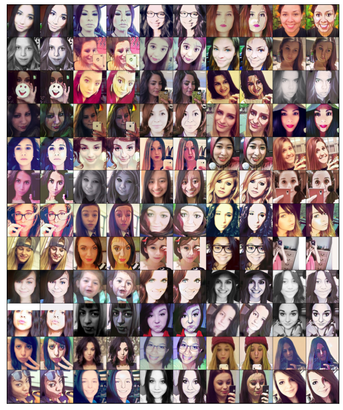

# Image-Translation-with-CycleGAN

1. [Introduction](#Introduction)
2. [Data Preprocessing](#DataPreprocessing)
3. [Discriminator](#Discriminator)
4. [Generator](#Generator)
5. [Training](#Training)
6. [Result](#Result)

## Introduction 

In this final project, I use [CycleGAN](https://junyanz.github.io/CycleGAN/) to develop an image translation system that converts real human faces in selfies to anime faces and vice versa. I use the sample unpaired dataset [selfie2anime](https://drive.google.com/file/d/1xOWj1UVgp6NKMT3HbPhBbtq2A4EDkghF/view). This source contains 3400 images each for selfies and anime faces in the training set and 100 in the validation. The selfie-to-anime generator is able to learn important features and make tangible changes under ideal conditions within  5 epochs, but the anime-to-real generator is much harder to train.

## Data Preprocessing 

I used 3400 unpair images for each category for training and 100 for validation. I include an image transformation step that resizes every image to 256 x 256 and normalizes images to have pixel values that follow the distribution of mean = 0.5 and standard deviation = 0.5 in each channel. In experiments, I find that this normalization can improve performance. Following the setup in the original paper, I use batch size = 1 for both training and validation data loader.

## Discriminator 

I use a discriminator that has a 70 x 70 PatchGANs structure, which aims to classify whether 70 x 70 overlapping image patches are real or fake. This is similar to the original paper. For input size 256 x 256, the output size of the discriminator is 30 x 30 where each patch is checking the 70 x 70 patch in the input image. The discriminator has four convolution blocks that perform 2-D down-sampling convolution and leaky Relu activation. The last layer in the discriminator has no activation and produces 30 x 30 output patches for checking.  Parameters like kernel size, stride, padding can be found in the notebook.

## Generator 

The generator has four major components: 1) 1 down-sampling block; 2) 9 residual blocks; 3) 1 up-sampling block; 4) output layers and activation to generator RGB pictures. The down-sampling block contains two convolution blocks that apply 2-D convolution, instance normalization and Relu activation. Similar to the original paper, I use 9 residual blocks for 256 x 256 input images.  Each residual block contains two convolution blocks that are similar to the ones used in down-sampling but preserve the input size.  The up-sampling block also used similar convolution building blocks but they perform up-sampling to increase the output size. Finally, a convolutional layer restores the output to images of size 3 x 256 x 256. Parameters like kernel size, stride, padding can be found in the notebook.

## Training 

In addition to the adversarial loss functions (MSE loss) for the discriminators and generators, I also implement cycle consistency loss and identity loss (L1 loss) as the original paper suggests. Cycle consistency loss reduces the space of potential translation and forces the model to construct images that preserve important features in the source images and identify loss prevents the model from unnecessarily translating the source image if provided. Compared to the reference materials, I reduce the weight assigned to the cycle consistency loss and identity loss to make it easier for generators to learn (but these two losses still weigh more than the generator loss). I use gradient scalers to improve the numerical stability in the training. Some hyperparameters are modified to account for computing resources constraints and or adjusted in the experiment to improve performance. Here is the list of hyperparameters:

- EPOCHS: 5
- LEARNING_RATE: 1e-4
- BETAS: (0.55, 0.999)
- LAMBDA for Cycle Consistency Loss: 10

## Result 

I train for 5 epochs and it takes around 3 hours. The best image translation pair is presented in Fig 1 below. The generator manages to learn some important characteristics of anime faces within 5 epochs. These features include larger eyes, pale skin tone, and hairstyle.  The color in the background is also brightened.

I also present the panel of 60 pairs of image translations in Fig 2 below, the best pair above is located in the 1st row and the 5th column. For most of the pairs, the translation is less noticeable. The difference in distribution between the selfies image collection and the anime one might explain this heterogeneity in translation quality. The anime image collection contains mostly well-centered pictures with the right level of brightness but the selfies taken in the real world have very different angles and brightness conditions. Additionally, most of the anime pictures have pale skin tones, but skin tones in the selfies collection have a wide spectrum. As a result, the anime-face generator works well for the typical case above where the face and eyes are centered and the human subject has a relatively pale skin tone. For many other cases where the face is not centered or the skin tone is not pale, the generator only manages to make the skin tone paler or slightly enlarges the eyes.

I experiment with anime-to-selfie translation but the selfie generator does not achieve satisfactory performance within 5 epochs. This inverse translation process is hard to achieve unlike some canonical problems such as zebra-to-horse and winter-to-summer. One reason could be that important features in the selfies are hard to capture and requires a longer training process.

